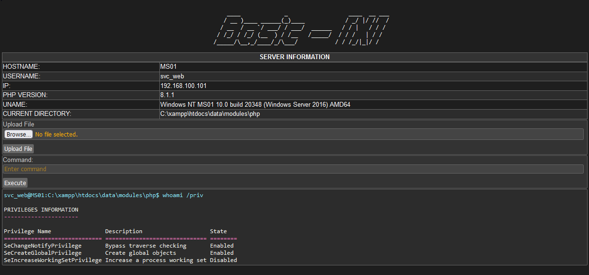

# Basic-X PHP Web Shell

## Overview

**Basic-X** is a simple PHP web shell. It demonstrates basic web-based functionalities such as:

- **Command Execution:** Run shell commands via a web interface.
- **File Upload:** Upload files to the server.
- **Server Information:** View server details including hostname, IP, and PHP version.

## Disclaimer

This tool is intended for educational and penetration testing purposes only. The author is not responsible for any unauthorized use or legal consequences resulting from the use of this tool. Ensure you have proper authorization before using it.
